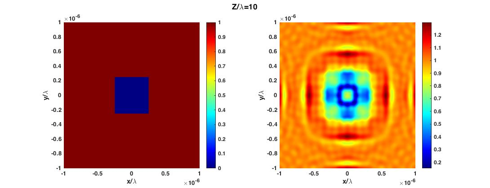

# Scalar Diffraction

## Introduction

Programs for realization of the scalar diffractions. Considering different imaging length ($L$, distance between imaging plane and mask), different diffraction models can be used

* Rayleigh-Sommerfeld Diffraction Integral First Kind (RSI) ($L<\lambda$)
* Fresnel Diffraction Integral ($L>\lambda$)
* Fraunhofer Integral ($L>30 \lambda$)

(1) `diffraction_scalar`: Direct integral realizations for three different formulars, corresponding MATLAB functions:

(2) `diffraction_scalar_RSI`: FFT methods for realizations of Rayleigh-Sommerfeld Diffraction

(3) `diffraction_scalar_RSI_Simpson`: FFT methods for realizations of Rayleigh-Sommerfeld Diffraction, Simpson rules to improve the accuracy

## Examples

### Comparison between different diffraction models

### FFT methods for RSI methods

### FFT Methods: Effect of Angles

